# Repok Pickleball Court Booking System


Repok is a full-stack pickleball court booking platform built as a solo portfolio project. It supports a complete customer booking flow, admin operations, wallet top-ups, payment review, booking holds, announcements, and analytics for a sports venue business.

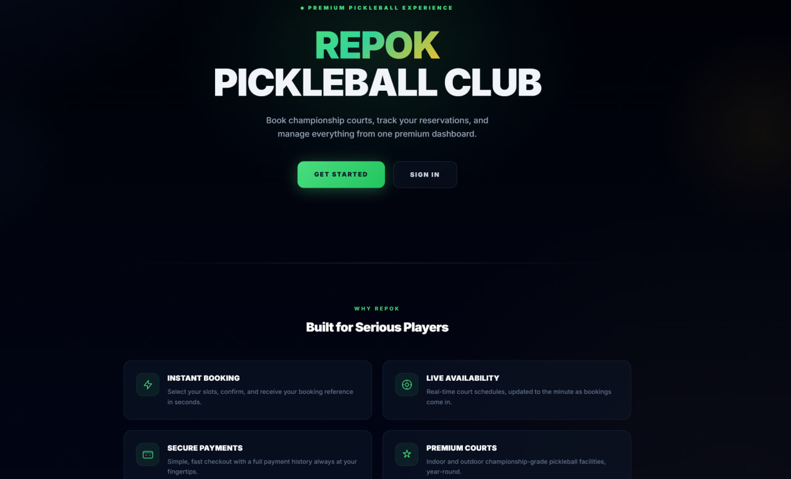

## Live Demo

| Service | Link | Notes |
|---|---|---|
| Frontend | Vercel deployment URL not stored in this repository yet | Add the production Vercel URL here when sharing the repo. |
| Backend API | <https://repok-backend.onrender.com> | Hosted on Render. Free instances may take up to around 50 seconds to wake after inactivity. |
| Backend health check | <https://repok-backend.onrender.com/health> | Lightweight uptime endpoint. |
| Demo video | [Google Drive walkthrough](https://drive.google.com/file/d/1OGIW4mQ8s5UksspGy_qBjqBSzMwUjvB4/view?usp=sharing) | Existing project walkthrough. |

## Tech Stack

| Area | Technologies |
|---|---|
| Frontend | Next.js 14 App Router, React 18, TypeScript, Tailwind CSS, TanStack React Query, Zustand, Axios |
| Backend | NestJS, TypeScript, Prisma ORM, REST API, scheduled jobs, request timing interceptor |
| Database | PostgreSQL hosted on Supabase, Prisma migrations |
| Authentication | JWT authentication, role-based admin guards, Google Sign-In support |
| Payments | Stripe Checkout for wallet top-ups, Stripe webhooks, manual QR payment review |
| Deployment | Vercel frontend, Render backend, Supabase database |
| Analytics / Visualization | Recharts admin dashboard, Prisma aggregate/groupBy, SQL-backed reporting queries |

## Key Features

### Customer Features

- Account registration, login, JWT sessions, and Google Sign-In support.
- Browse pickleball courts with category, status, pricing, and court details.
- Select date-based court availability and choose available time slots.
- Create pending bookings with a booking reference and expiry countdown.
- Pay with wallet credits or submit manual QR payment proof.
- Top up wallet credits through Stripe Checkout using package or custom amounts.
- View personal bookings, booking details, wallet balance, and wallet transaction history.

### Admin Features

- Manage court records, pricing, category, and booking status.
- Generate availability slots through the backend API and block or reopen individual slots from the admin availability page.
- Review manual QR payment proof and approve or reject payments.
- Manage announcements shown to customers.
- View booking, payment, user, court, and announcement admin pages.
- Use the analytics dashboard for revenue, booking volume, court utilization, peak hours, payment sources, and wallet metrics.
- See pending manual payment counts through a lightweight payment summary endpoint.

### System / Engineering Features

- Booking hold and expiry system for unpaid pending bookings.
- Scheduled expiry cleanup that releases held slots when bookings expire.
- Stripe webhook handling for wallet top-ups with idempotent crediting guards.
- Prisma schema, migrations, and relational PostgreSQL data model.
- Performance-oriented PostgreSQL indexes for availability, bookings, payments, wallet history, top-ups, announcements, and analytics queries.
- Backend `/health` endpoint for deployment health checks.
- Global request timing logs for identifying slow APIs in backend logs.

## Performance Optimization Pass

The project includes a focused backend and frontend performance pass:

- Added a NestJS global request timing interceptor that logs method, route, status code, and duration without logging request bodies or secrets.
- Added a lightweight backend health endpoint at `/health`.
- Batched expired booking cleanup so stale holds are expired and released with fewer database round trips.
- Reduced unnecessary Prisma payloads with narrower `select` usage on list/detail endpoints.
- Added practical PostgreSQL indexes based on actual filtering, sorting, and aggregation patterns.
- Optimized admin analytics by moving day/hour/repeat-customer aggregation into database queries instead of loading all rows into memory.
- Added short TTL caching for safe reads such as courts, active announcements, and analytics summaries.
- Avoided caching sensitive or real-time data such as wallet balance, payment status, booking availability, and active booking holds.
- Reduced frontend refetching and replaced the admin pending-payment badge polling with a small summary endpoint.

## Architecture

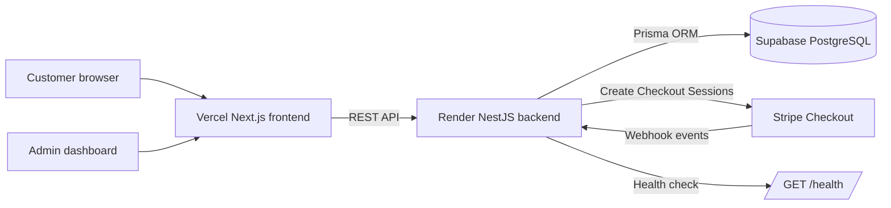

## Data Model Overview

The Prisma schema models the booking workflow around these core entities:

| Model Area | Purpose |
|---|---|
| `User` | Customer/admin accounts, roles, profile data, authentication relationships |
| `Court`, `CourtAvailability` | Bookable courts and date/time slot inventory |
| `Booking`, `BookingItem` | Booking records and the selected court availability slots |
| `Payment` | Manual QR payment state and booking payment status tracking |
| `Wallet`, `WalletTransaction`, `TopUpOrder` | Wallet balance, booking deductions, Stripe top-up orders |
| `Announcement`, `Comment` | Admin announcements and customer discussion |

## Screenshots

### Customer Experience

| Courts | Court Booking | My Bookings |
|---|---|---|
| 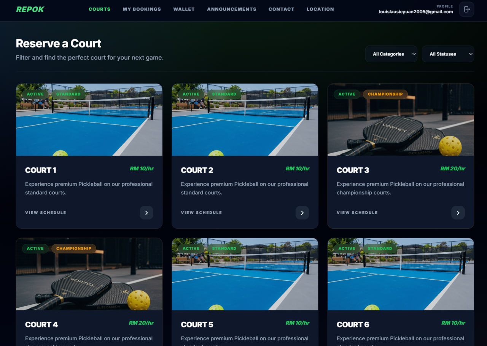 | 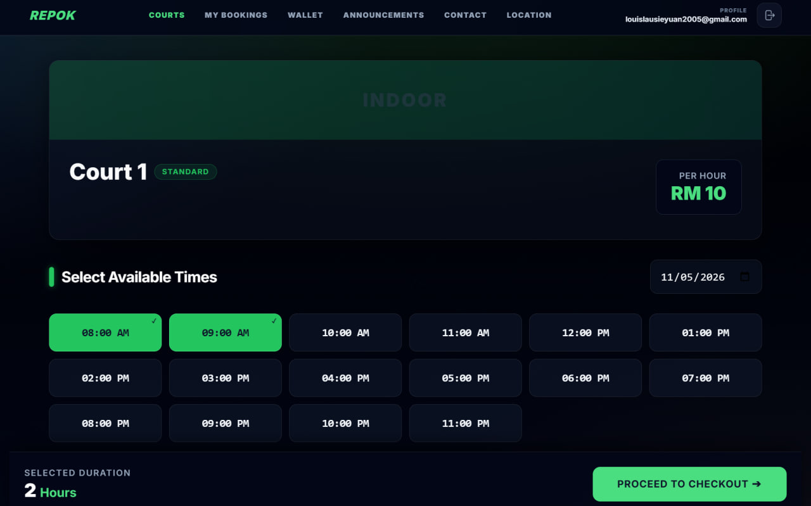 | 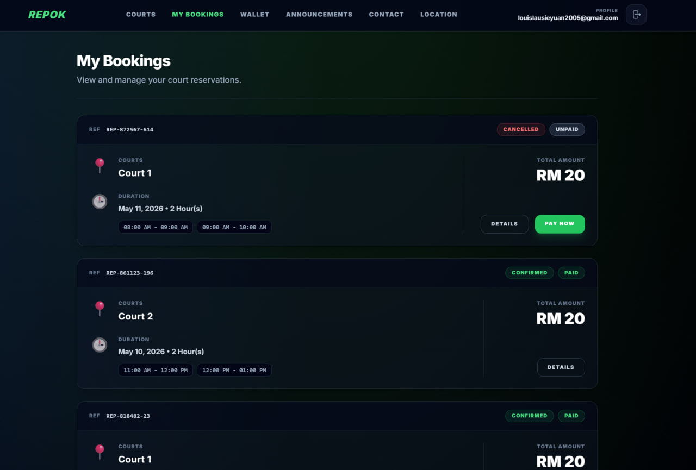 |

### Payment and Wallet

| Payment - Wallet | Payment - Manual QR | Stripe Checkout |
|---|---|---|
| 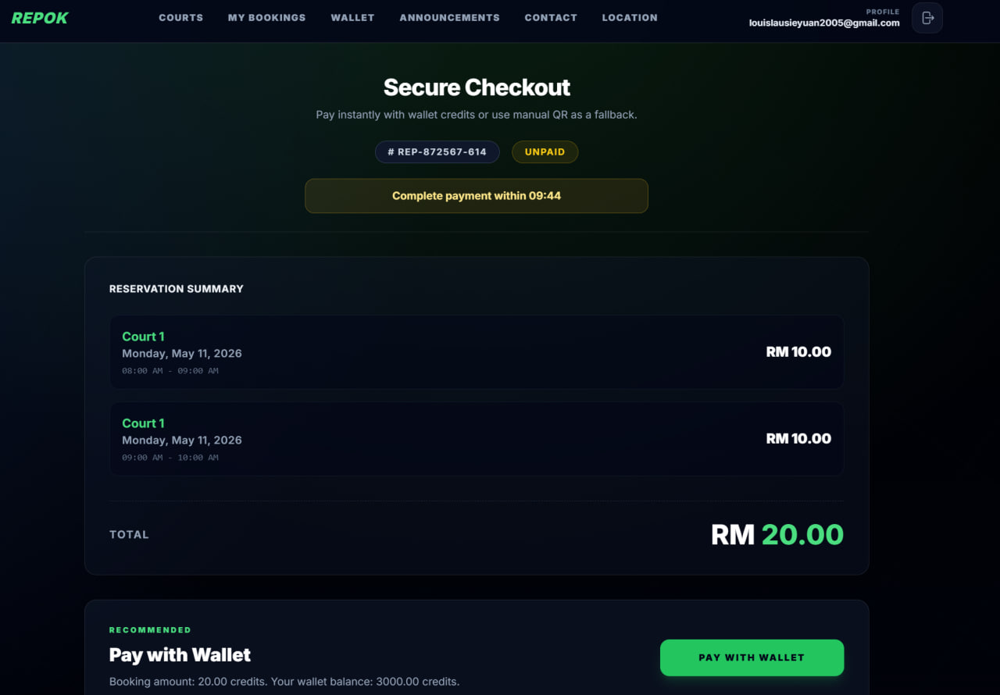 | 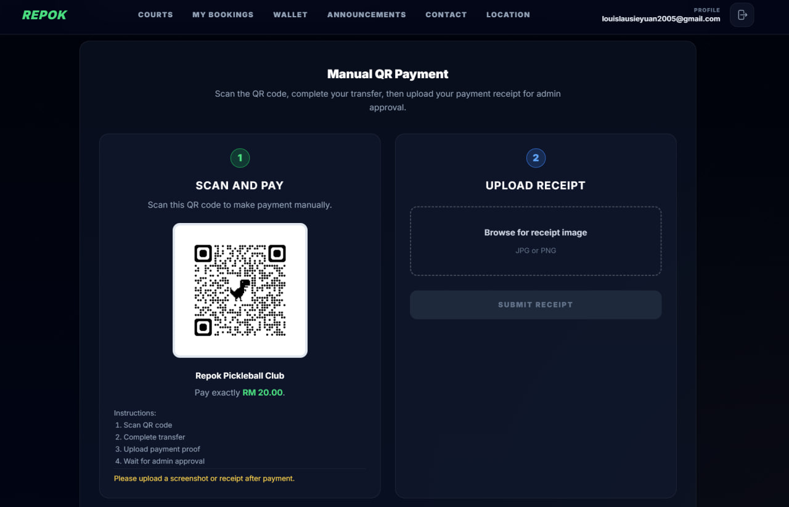 | 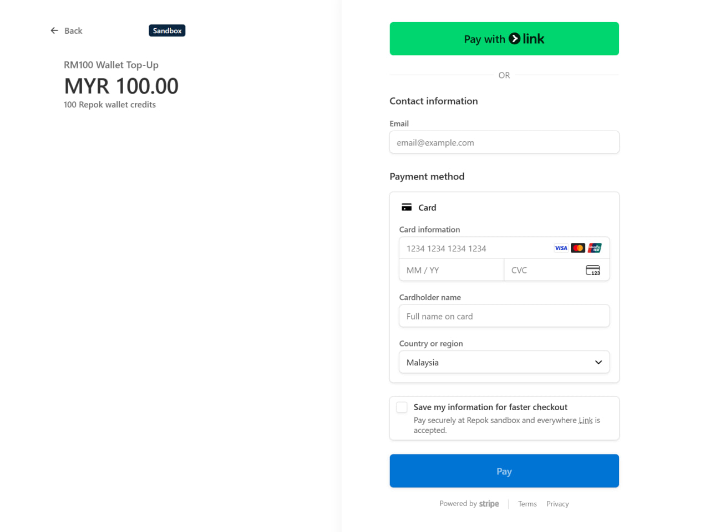 |

| Wallet | Wallet Top-Up |
|---|---|
| 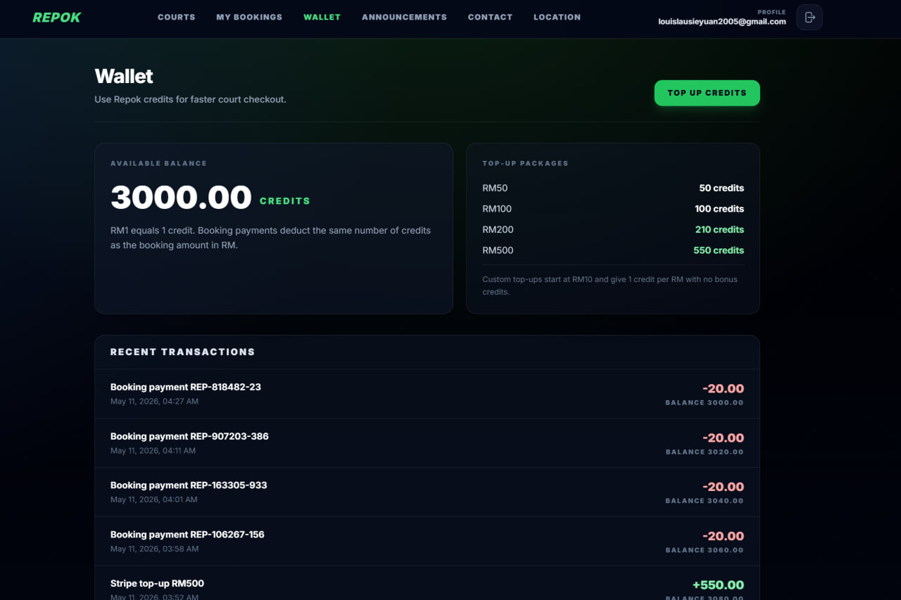 | 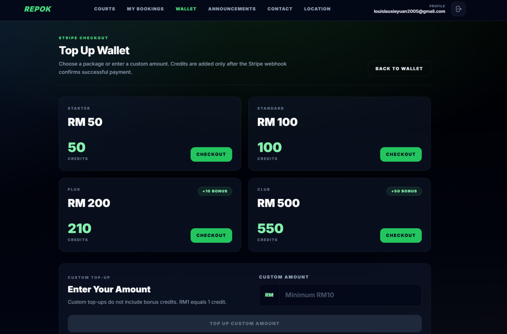 |

### Admin

| Payment Review | Analytics Dashboard |
|---|---|
| 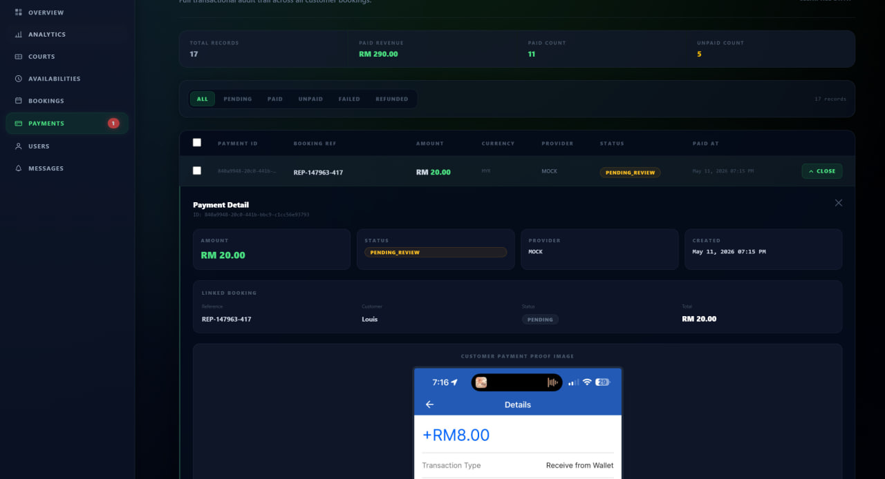 | 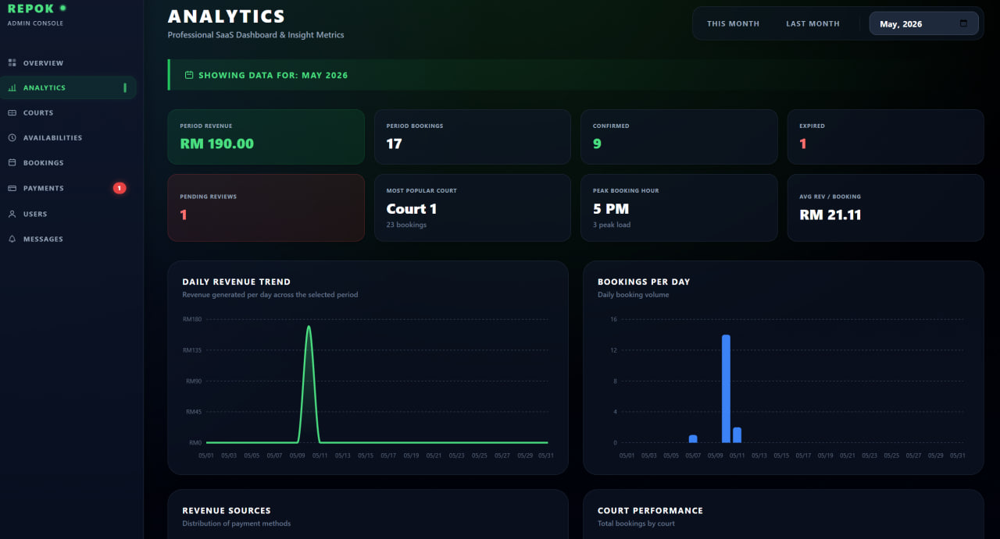 |

### Responsive UI

| Mobile Navigation |
|---|
| 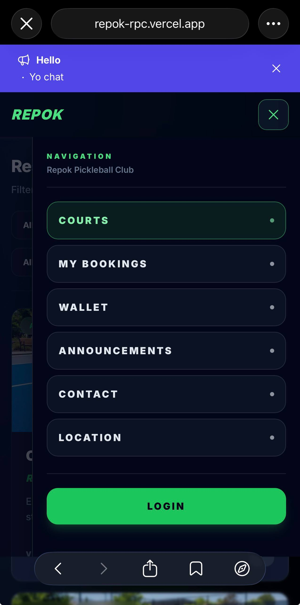 |

## Local Development Setup

### 1. Clone the repository

```bash
git clone <repository-url>
cd "PickleBall Court Booking Website"
```

### 2. Install dependencies

Install root Prisma tooling:

```bash
npm install
```

Install backend dependencies:

```bash
cd backend
npm install
```

Install frontend dependencies:

```bash
cd ../frontend
npm install
```

### 3. Create environment files

Create these files from the examples and fill in local development values:

```bash
backend/.env
frontend/.env.local
```

Do not commit real secrets, API keys, database URLs, JWT secrets, Stripe keys, webhook secrets, or SMTP credentials.

### 4. Generate Prisma client and run migrations

From the repository root:

```bash
npx prisma generate --schema=prisma/schema.prisma
npx prisma migrate dev --schema=prisma/schema.prisma
```

For production databases, use `migrate deploy` instead of `migrate dev`.

### 5. Start the backend

```bash
cd backend
npm run start:dev
```

The local backend runs on `http://localhost:3001` by default.

### 6. Start the frontend

In a separate terminal:

```bash
cd frontend
npm run dev
```

The local frontend runs on `http://localhost:3000`.

## Environment Variables

Use variable names only in documentation and repository examples. Store real values in local or deployment environment settings.

### Frontend

```env
NEXT_PUBLIC_API_URL=
NEXT_PUBLIC_API_BASE_URL=
NEXT_PUBLIC_GOOGLE_CLIENT_ID=
NEXT_PUBLIC_STRIPE_PUBLISHABLE_KEY=
```

### Backend

```env
DATABASE_URL=
JWT_SECRET=
GOOGLE_CLIENT_ID=
STRIPE_SECRET_KEY=
STRIPE_WEBHOOK_SECRET=
FRONTEND_URL=
FRONTEND_URLS=
SLOW_REQUEST_MS=
```

## Deployment

### Frontend: Vercel

- Deploy the `frontend` app to Vercel.
- Set the frontend environment variables in the Vercel project settings.
- Point `NEXT_PUBLIC_API_URL` or `NEXT_PUBLIC_API_BASE_URL` to the Render backend URL.

### Backend: Render

- Deploy the NestJS backend to Render.
- Configure the backend build/start commands for the `backend` app:

```bash
npm install
npm run build
npm run start:prod
```

- Configure the health check path:

```text
/health
```

- Current backend base URL:

```text
https://repok-backend.onrender.com
```

### Database: Supabase PostgreSQL

- Store the Supabase PostgreSQL connection string in the backend `DATABASE_URL`.
- Run production migrations from the repository root:

```bash
npx prisma migrate deploy --schema=prisma/schema.prisma
```

### Stripe Webhooks

- Configure Stripe to send webhook events to:

```text
https://repok-backend.onrender.com/payments/stripe/webhook
```

- Store the webhook signing secret only in Render environment variables.

## Useful Commands

| Command | Location | Purpose |
|---|---|---|
| `npm run dev` | `frontend` | Start Next.js dev server |
| `npm run build` | `frontend` | Build frontend for production |
| `npm run lint` | `frontend` | Run Next.js lint |
| `npm run start:dev` | `backend` | Start NestJS backend in watch mode |
| `npm run build` | `backend` | Generate Prisma client and build backend |
| `npm run start:prod` | `backend` | Start built backend |
| `npx prisma generate --schema=prisma/schema.prisma` | repo root | Generate Prisma client |
| `npx prisma migrate dev --schema=prisma/schema.prisma` | repo root | Apply local development migrations |
| `npx prisma migrate deploy --schema=prisma/schema.prisma` | repo root | Apply production migrations |

## Engineering Highlights

- Designed and implemented a full-stack booking workflow from court browsing to slot selection, booking creation, payment, and booking history.
- Handled payment state consistency across wallet credits, manual QR review, booking status, and Stripe top-up webhooks.
- Built admin workflows for court operations, availability management, payment review, announcements, and analytics.
- Optimized backend and database performance with request timing logs, narrower Prisma queries, batched expiry cleanup, short TTL caching, and PostgreSQL indexes.
- Deployed a multi-service application using Vercel, Render, and Supabase.

## Documentation

- [Architecture notes](docs/ARCHITECTURE.md)
- [API overview](docs/API_OVERVIEW.md)
- [Deployment guide](docs/deployment.md)
- [Screenshot gallery](docs/SCREENSHOTS.md)
- [Stripe wallet local setup](docs/stripe-wallet-local.md)
- [Resume case study](docs/RESUME_CASE_STUDY.md)

## Author

Built by Louis Lau as a solo full-stack portfolio project.
