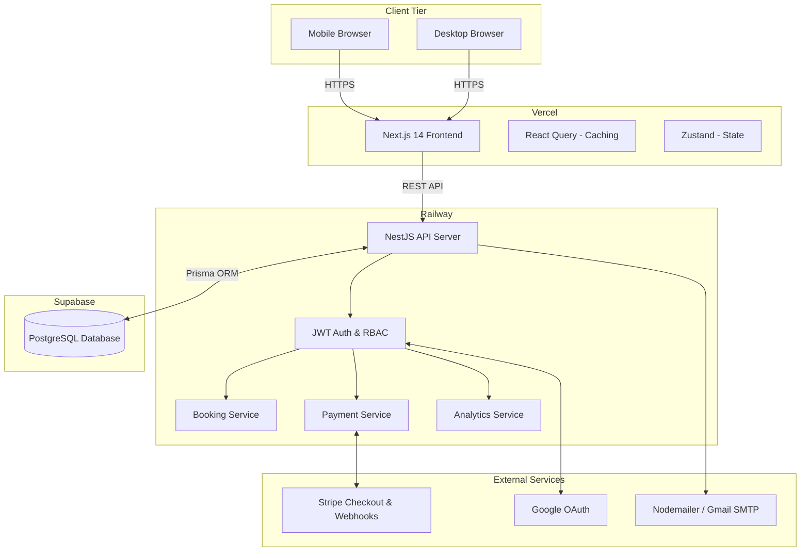
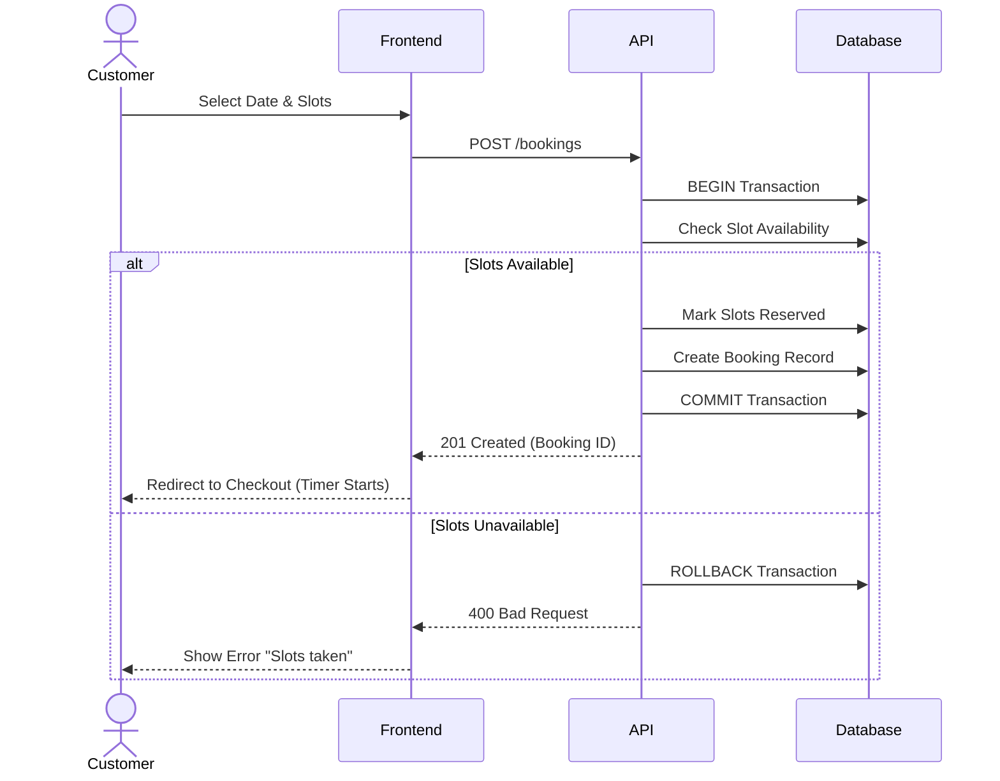
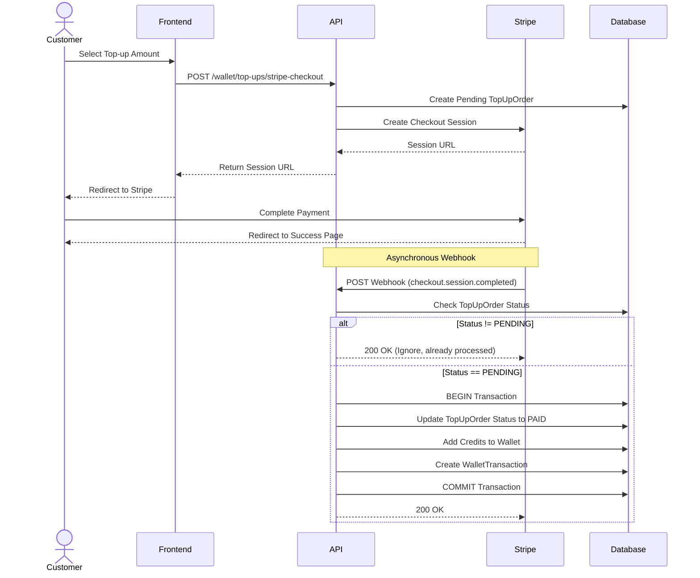
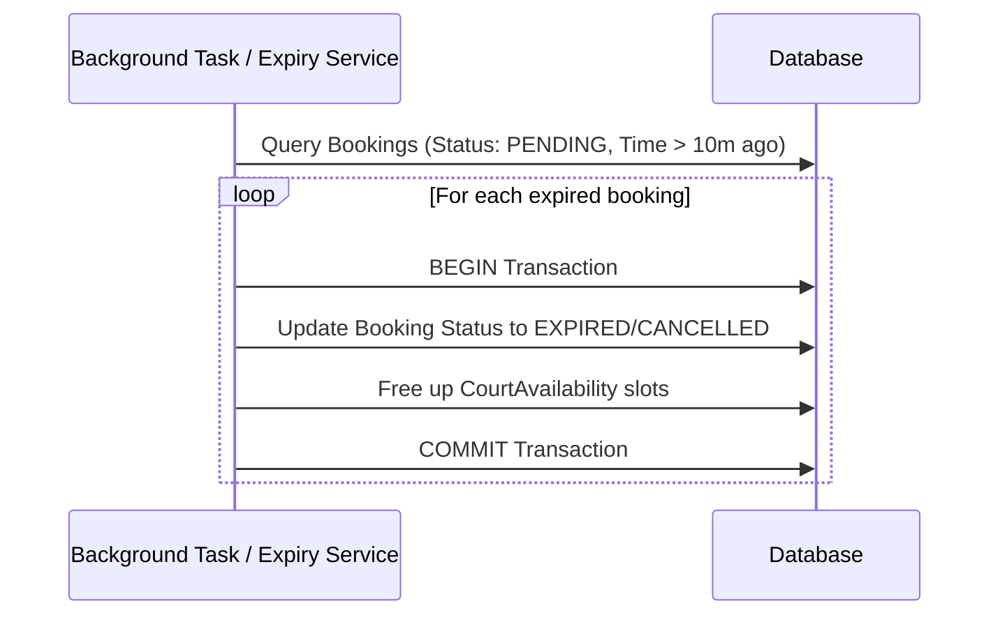
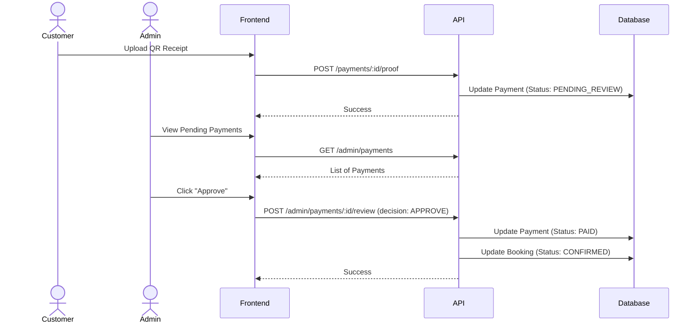

# Architecture Documentation

## 1. Overall System Architecture

## 2. Customer Booking Sequence

## 3. Stripe Wallet Top-Up & Idempotency Flow

## 4. Booking Expiry Flow

## 5. Manual QR Payment Approval Sequence

## 6. Folder Structure & Separation of Concerns

- `/frontend` (Next.js Application)
  - `/src/app`: App Router structure, segregated into `(admin)` and customer-facing routes.
  - `/src/components`: Reusable UI components.
  - `/src/lib/api`: API client configuration with direct backend mapping.
  - `/src/providers`: React Query and Context providers.
  - `/src/store`: Zustand state slices.
- `/backend` (NestJS Application)
  - `/src/admin`: Admin specific logic and analytics.
  - `/src/bookings`: Booking orchestration.
  - `/src/courts`: Court management.
  - `/src/payment`: Stripe and Manual payment handling.
  - `/src/wallet`: Wallet top-up and deduction logic.
- `/prisma` (Database Schema and Migrations)
  - `/prisma/schema.prisma`
  - `/prisma/migrations`
  - `/prisma/seed.ts`

## 7. Security Boundaries
- **Frontend vs Backend**: The frontend holds no secrets. All environment variables containing secrets (e.g., Stripe Keys, DB URLs) strictly exist on the backend server.
- **Client vs Admin**: API routes prefixed with `/admin` require a JWT containing the `ADMIN` role. The frontend mirrors this by restricting view access to admin components.
- **Idempotency**: Webhook logic strictly verifies transaction status before crediting, preventing malicious or accidental repeated network requests from inflating a user's wallet.
